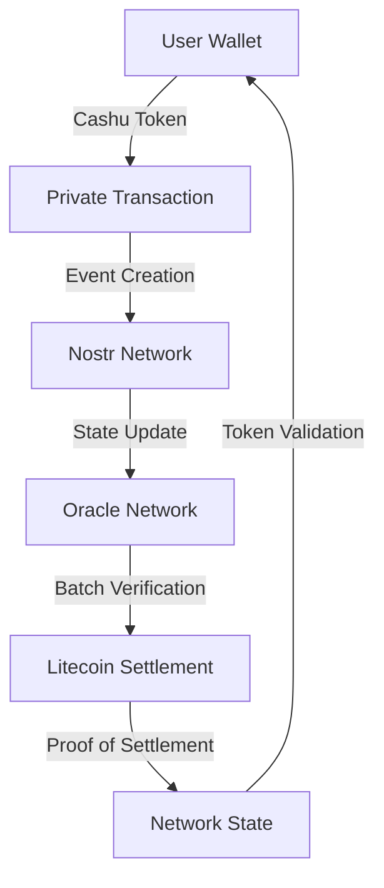

# AreteCoin: Multi-Layer Digital Value Network

## Architecture Overview

### Layer 0: Cashu Privacy Layer
- **Purpose**: Private wallet-to-wallet transactions
- **Components**:
  - Chaumian blind signatures for privacy
  - Ecash tokens for value transfer
  - Mint-based token issuance
- **Integration Points**:
  - Wallet-level privacy
  - Micro-transaction support
  - Token proof generation

### Layer 1: Nostr Event Network
- **Purpose**: Fast state propagation and social proof
- **Components**:
  - Event chains (like our list versioning)
  - Relay network for distribution
  - NIP-60 for wallet integration
- **Features**:
  - Real-time state updates
  - Social graph integration
  - Event verification

### Layer 2: Oracle Network
- **Purpose**: State validation and consensus
- **Components**:
  - Validator nodes (Oracle Relays)
  - State transition rules
  - Consensus mechanisms
- **Features**:
  - Token verification
  - State aggregation
  - Batch processing

### Layer 3: Litecoin Settlement
- **Purpose**: Permanent state record
- **Components**:
  - Ordinal inscriptions
  - Batch settlements
  - Proof of finality
- **Features**:
  - Immutable history
  - Value anchoring
  - Cross-chain bridging

## Token Flow Architecture



## Value Propositions

### 1. Privacy-First Transactions
- Blind signatures from Cashu
- Private wallet balances
- Anonymous transactions
- Optional transparency

### 2. Social Value Layer
- Reputation tracking
- Social proof of ownership
- Community validation
- Network effect amplification

### 3. Oracle-Based Consensus
- Distributed validation
- Multi-party verification
- Fraud prevention
- State consistency

### 4. Permanent Settlement
- Immutable history
- Value anchoring
- Cross-chain compatibility
- Proof of existence

## Token Economics

### 1. Token Types
- **Private Tokens** (Cashu Layer)
  - Blind signature based
  - Instant transfers
  - Full privacy

- **Network Tokens** (Nostr Layer)
  - Social proof attached
  - Transparent history
  - Community validation

- **Settlement Tokens** (Litecoin Layer)
  - Permanent record
  - Cross-chain value
  - Immutable proof

### 2. Value Flow
1. **Creation**:
   - Mint issues private tokens
   - Oracle network validates
   - Social proof attached

2. **Circulation**:
   - Private wallet transfers
   - Network state updates
   - Oracle verification

3. **Settlement**:
   - Batch processing
   - Litecoin anchoring
   - Proof distribution

## Implementation Strategy

### Phase 1: Wallet Integration
1. Implement Cashu wallet functionality
2. Add Nostr event creation
3. Develop token tracking

### Phase 2: Oracle Network
1. Build validator nodes
2. Implement consensus rules
3. Create batch processing

### Phase 3: Settlement Layer
1. Develop Ordinal creation
2. Implement proof system
3. Build cross-chain bridges

## Technical Components

### 1. Wallet Implementation
```javascript
class AreteWallet {
    // Cashu integration
    async createToken(amount) {
        const blindedMessage = await cashu.blind(amount);
        const signature = await mint.sign(blindedMessage);
        return cashu.unblind(signature);
    }

    // Nostr event creation
    async createTransferEvent(token) {
        const event = {
            kind: 1337,  // Custom kind for AreteCoin
            content: '',
            tags: [
                ['t', 'transfer'],
                ['token', token.id],
                ['proof', token.proof]
            ]
        };
        return await nostr.signEvent(event);
    }

    // Oracle verification
    async verifyWithOracle(token, event) {
        const oracleProof = await oracle.verify({
            token,
            event,
            network: 'arete'
        });
        return oracleProof;
    }
}
```

### 2. Oracle Node Implementation
```javascript
class AreteOracle {
    // State validation
    async validateState(event) {
        const token = event.getToken();
        const proof = event.getProof();
        
        // Check multiple conditions
        const validSignature = await this.verifySignature(token);
        const validHistory = await this.checkHistory(token);
        const networkConsensus = await this.getConsensus(token);

        return {
            valid: validSignature && validHistory && networkConsensus,
            proof: this.generateProof(token, event)
        };
    }

    // Batch processing
    async processBatch(events) {
        const batch = new BatchProcessor(events);
        const ordinal = await this.createOrdinal(batch);
        return ordinal;
    }
}
```

### 3. Settlement Integration
```javascript
class AreteSettlement {
    // Ordinal creation
    async createOrdinal(batch) {
        const inscription = {
            type: 'arete/batch',
            version: '1',
            events: batch.getHashes(),
            proof: batch.getProof()
        };
        return await litecoin.inscribe(inscription);
    }

    // Cross-chain proof
    async verifySettlement(ordinal) {
        const proof = await litecoin.getProof(ordinal);
        const verification = await this.verifyMerkleProof(proof);
        return verification;
    }
}
```

## Security Considerations

### 1. Privacy Protection
- Blind signature implementation
- Zero-knowledge proofs
- Transaction unlinkability

### 2. Network Security
- Relay redundancy
- Oracle consensus rules
- Sybil attack prevention

### 3. Settlement Security
- Proof verification
- Double-spend prevention
- Batch validation

## Future Extensions

### 1. Smart Contracts
- Conditional transfers
- Time-locked tokens
- Multi-signature support

### 2. Cross-Chain Integration
- Bitcoin Lightning Network
- Other blockchain bridges
- DeFi integration

### 3. Social Features
- Reputation systems
- Community governance
- Social recovery

## Next Steps

1. **Prototype Development**
   - Implement basic wallet
   - Build test oracle network
   - Create settlement mechanism

2. **Network Testing**
   - Deploy test tokens
   - Validate state transitions
   - Measure performance

3. **Community Building**
   - Developer documentation
   - Community governance
   - Network incentives
