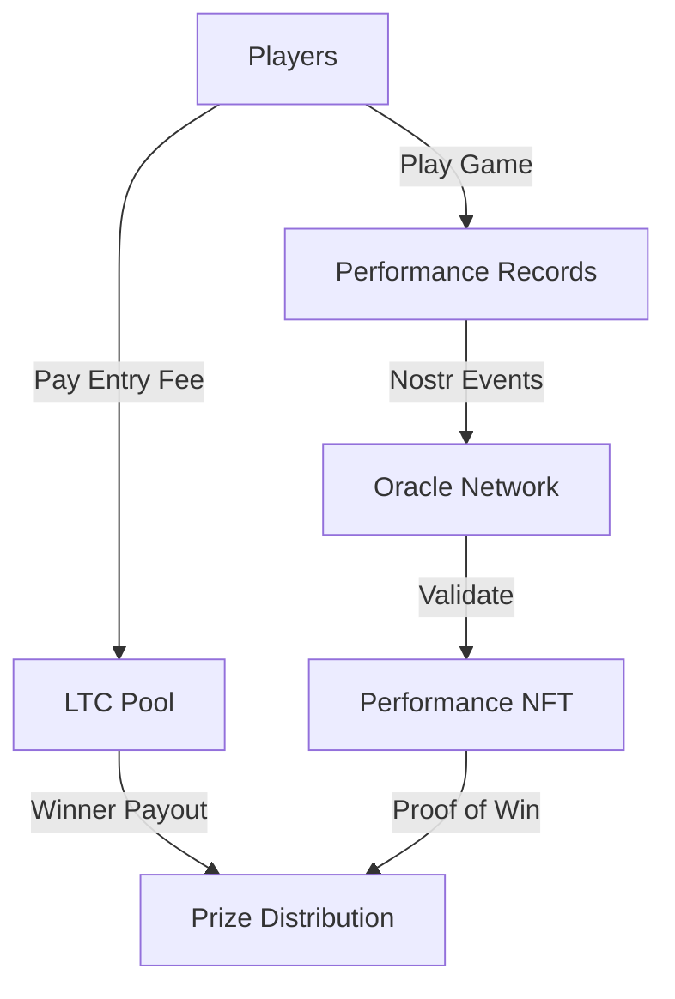

# "Best in 28" Game Flow

## Basic Flow


## Components

### 1. Entry & Pool
```javascript
class GamePool {
    // 28-day cycle
    cycleDuration: 28 * 24 * 60 * 60;  // seconds
    startTime: timestamp;
    
    // Pool management
    ltcPool: {
        address: string,        // Multisig address
        totalAmount: number,    // Current pool size
        entryFee: number       // Cost to enter
    };

    // Entry tracking
    entries: {
        playerPubkey: string,
        entryTime: timestamp,
        ltcTxId: string,       // Entry fee transaction
        performanceNFT: string  // Minted after performance
    }[];
}
```

### 2. Performance Recording
```javascript
class GamePerformance {
    // Performance data
    metrics: {
        score: number,
        tricks: string[],
        duration: number,
        timestamp: timestamp
    };

    // Nostr event creation
    async createPerformanceEvent() {
        return {
            kind: 1337,
            content: JSON.stringify(this.metrics),
            tags: [
                ['p', playerPubkey],
                ['entry', entryTxId],
                ['cycle', currentCycle]
            ]
        };
    }
}
```

### 3. Oracle Network
```javascript
class OracleNetwork {
    // Validate performance
    async validatePerformance(event) {
        // Multiple oracles check:
        // 1. Game data authenticity
        // 2. Entry fee payment
        // 3. Timing within cycle
        return {
            valid: boolean,
            score: number,
            rank: number,
            proof: string
        };
    }

    // Create consensus
    async createConsensus(validations) {
        // Require 2/3 oracle agreement
        return {
            consensus: boolean,
            finalScore: number,
            winningProof: string
        };
    }
}
```

### 4. NFT Minting
```javascript
class PerformanceNFT {
    // Mint on Litecoin
    async mintNFT(performance, proof) {
        return {
            type: 'ordinal',
            content: {
                game: 'SACQ',
                cycle: currentCycle,
                performance: performance,
                proof: proof,
                rank: rank
            }
        };
    }
}
```

### 5. Prize Distribution
```javascript
class PrizeDistribution {
    // Distribute prizes
    async distributePrizes(winners) {
        // Split pool based on rank
        const distribution = {
            first: 0.5,    // 50% to first
            second: 0.3,   // 30% to second
            third: 0.2     // 20% to third
        };

        return {
            payouts: winners.map(w => ({
                pubkey: w.pubkey,
                amount: pool * distribution[w.rank],
                nft: w.performanceNFT
            }))
        };
    }
}
```

## Technical Flow

1. **Entry Phase**
```javascript
// Player enters
async function enterCycle() {
    // 1. Pay LTC entry fee
    const entryTx = await payEntryFee(ENTRY_FEE);
    
    // 2. Register entry
    const entry = await pool.registerEntry(playerPubkey, entryTx);
    
    // 3. Start tracking performance
    return startPerformanceTracking(entry);
}
```

2. **Performance Phase**
```javascript
// Record performance
async function recordPerformance(gameData) {
    // 1. Create performance record
    const perf = new GamePerformance(gameData);
    
    // 2. Broadcast to Nostr
    const event = await perf.createPerformanceEvent();
    
    // 3. Get oracle validation
    return await oracles.validatePerformance(event);
}
```

3. **Validation Phase**
```javascript
// Oracle consensus
async function validateWinner() {
    // 1. Collect all performances
    const performances = await getPerformances(currentCycle);
    
    // 2. Get oracle consensus
    const consensus = await oracles.createConsensus(performances);
    
    // 3. Mint winner NFT
    return await mintWinnerNFT(consensus);
}
```

4. **Distribution Phase**
```javascript
// Distribute prizes
async function endCycle() {
    // 1. Finalize rankings
    const winners = await getFinalRankings();
    
    // 2. Mint NFTs
    const nfts = await mintPerformanceNFTs(winners);
    
    // 3. Distribute LTC
    return await distributePool(winners, nfts);
}
```

## Implementation Requirements

### 1. Game Platform
- Performance tracking
- Score verification
- Anti-cheat measures
- Real-time updates

### 2. Oracle Network
- Multiple independent oracles
- Consensus mechanism
- Performance validation
- Cheat detection

### 3. Litecoin Integration
- Multisig pool
- NFT minting
- Prize distribution
- Transaction verification

### 4. Nostr Layer
- Event broadcasting
- Performance recording
- Social proof
- Witness network

## Security Considerations

1. **Entry Security**
   - Verify LTC payments
   - Track entry timing
   - Prevent duplicate entries
   - Secure pool funds

2. **Performance Security**
   - Validate game data
   - Prevent tampering
   - Track attempts
   - Verify timestamps

3. **Distribution Security**
   - Multisig releases
   - Oracle consensus
   - Proof verification
   - NFT authenticity

## Next Steps

1. **Prototype Components**
   - Entry system
   - Performance tracking
   - Oracle network
   - Prize distribution

2. **Testing Requirements**
   - Payment flow
   - Game validation
   - Oracle consensus
   - NFT minting

3. **Launch Preparation**
   - Security audit
   - Oracle recruitment
   - Pool setup
   - Community building
