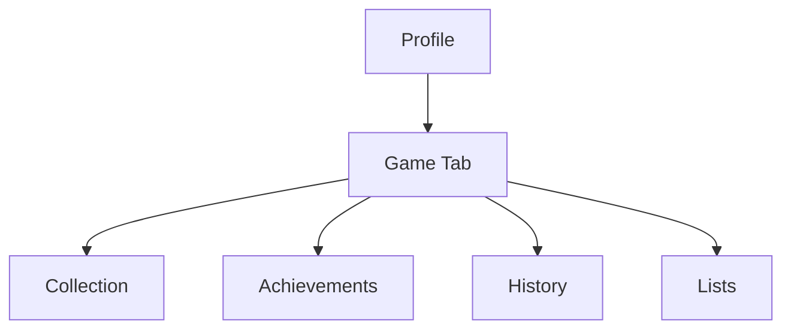

# MAIQR.BIO Game Profile Integration

## Profile Extensions

### 1. Game Events (kind: 31337)
```javascript
// Game performance event
{
    kind: 31337,
    content: {
        game: "SACQ",
        performance: {
            score: number,
            tricks: string[],
            achievements: string[]
        },
        nft: {
            type: "sand|bean|plastic|metal|gem",
            id: "ordinal_id"
        }
    },
    tags: [
        ["g", "game_id"],
        ["s", "score"],
        ["c", "cycle_id"],
        ["nft", "ordinal_id"]
    ]
}
```

### 2. Profile Sections

#### Game Collection
```javascript
class GameCollection {
    // NFT showcase
    displayCase: {
        featured: NFT[],      // Best/favorite sacks
        recent: NFT[],        // Latest wins
        rare: NFT[]          // Gem/special editions
    };
    
    // Achievement display
    achievements: {
        badges: Achievement[],
        rankings: Rank[],
        records: Record[]
    };
}
```

#### Performance History
```javascript
class PerformanceHistory {
    // Game stats
    statistics: {
        totalGames: number,
        bestScore: number,
        favoriteTricks: string[],
        winRate: number
    };
    
    // Competition history
    competitions: {
        participated: Event[],
        wins: Event[],
        rankings: Rank[]
    };
}
```

### 3. List Integration

#### Game Lists
```javascript
class GameLists {
    // Custom list types
    types: {
        collection: "owned_nfts",
        wishlist: "wanted_nfts",
        trades: "available_trades",
        achievements: "completed_achievements"
    };
    
    // List display
    display: {
        format: "grid|list",
        sorting: "rarity|date|value",
        filters: ["type", "rarity", "status"]
    };
}
```

## Profile Views

### 1. Game Tab


### 2. Integration Points
```javascript
class ProfileIntegration {
    // Game data display
    gameSection: {
        location: "main_profile",
        visibility: "public|private",
        updateFrequency: "real-time"
    };
    
    // Social features
    social: {
        challenges: boolean,
        trading: boolean,
        messaging: boolean,
        following: boolean
    };
    
    // List features
    lists: {
        custom: boolean,
        sharing: boolean,
        collaboration: boolean,
        discovery: boolean
    };
}
```

## Data Flow

### 1. Event Processing
```javascript
class EventProcessor {
    // Handle game events
    async processGameEvent(event) {
        // 1. Validate event
        const valid = await validateEvent(event);
        
        // 2. Update profile
        if (valid) {
            await updateProfile(event);
            await updateLists(event);
            await notifyFollowers(event);
        }
    }
}
```

### 2. Profile Updates
```javascript
class ProfileUpdater {
    // Update profile sections
    async updateGameSection(data) {
        // 1. Add new achievements
        await addAchievements(data.achievements);
        
        // 2. Update statistics
        await updateStats(data.performance);
        
        // 3. Update collections
        await updateNFTs(data.nfts);
        
        // 4. Update lists
        await updateRelatedLists(data);
    }
}
```

## Implementation Plan

### 1. Profile Extensions
- [ ] Add game tab to profile
- [ ] Create NFT display components
- [ ] Build achievement system
- [ ] Integrate performance history

### 2. List Features
- [ ] Add game-specific list types
- [ ] Create NFT list templates
- [ ] Build trading interface
- [ ] Add collection management

### 3. Social Features
- [ ] Challenge system
- [ ] Trading notifications
- [ ] Achievement sharing
- [ ] Game event feed

### 4. Data Management
- [ ] Event processing system
- [ ] Profile update mechanism
- [ ] List synchronization
- [ ] Cache management

## Security Considerations

### 1. Event Verification
- Validate game events
- Check NFT ownership
- Verify achievements
- Confirm trades

### 2. Privacy Controls
- Public/private toggles
- Selective sharing
- Trading permissions
- Challenge settings

### 3. Data Integrity
- Event consistency
- Profile accuracy
- List management
- Trade verification

## Next Steps

1. **Profile Updates**
   - Design game tab
   - Create NFT components
   - Build list integration
   - Add social features

2. **Event System**
   - Implement event processing
   - Build validation system
   - Create update mechanism
   - Add notification system

3. **Testing**
   - Profile integration
   - List functionality
   - Event processing
   - Social features
