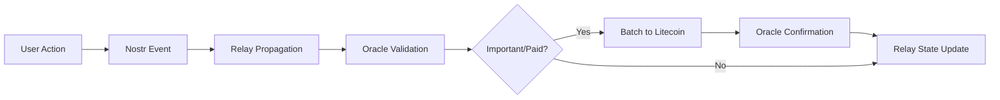

# Noisy Network Architecture: Nostr + Oracle Relays + Litecoin Settlement

## Overview
A three-layer architecture combining Nostr's flexible event network, oracle relays for validation, and Litecoin Ordinals for permanent state settlement. This creates a balanced system between speed, flexibility, and security.

## Layer Architecture

### Layer 1: Nostr Event Network (Noisy Layer)
- **Purpose**: Fast, real-time event propagation and state updates
- **Characteristics**:
  - Quick event propagation across relays
  - Flexible event types (lists, content, actions)
  - Chain of related events through references
  - Soft deletions and state updates
- **Example**: Our list management system showing:
  - Event chains through `["e", "previous_id", "reply"]` tags
  - State tracking across multiple relays
  - Version history forming natural chains

### Layer 2: Oracle Relays (Validation Layer)
- **Purpose**: Validate and curate state transitions
- **Functions**:
  - Track event chains and validate state transitions
  - Aggregate consensus from multiple relays
  - Queue important state changes for blockchain settlement
  - Act as bridge between Nostr and Litecoin
- **Characteristics**:
  - Semi-trusted nodes
  - State validation rules
  - Consensus mechanisms
  - Batching logic for settlement

### Layer 3: Litecoin Settlement (Finality Layer)
- **Purpose**: Permanent state settlement through Ordinals
- **Advantages**:
  - Lower fees than Bitcoin
  - Faster block times (2.5 minutes)
  - Less network congestion
  - Sufficient security for most use cases
- **Usage**:
  - Important state transitions
  - Paid actions
  - Permanent records
  - Asset tokenization

## Security Model

### Trust Distribution
1. **User Level**
   - Private key requirement
   - Event signing
   - State update initiation

2. **Network Level**
   - Multiple relay verification
   - Event propagation consensus
   - State consistency checks

3. **Oracle Level**
   - State validation
   - Transition rules
   - Batching logic
   - Settlement decisions

4. **Blockchain Level**
   - Final settlement
   - Permanent record
   - Immutable history

### Attack Resistance
- Requires compromise of:
  1. User private keys
  2. Multiple oracle relays
  3. Litecoin transaction fees
  4. Network consensus

## Use Cases

### Immediate Applications
1. **Content Management**
   - Rights tracking
   - Version control
   - Attribution chains

2. **Digital Assets**
   - Ownership records
   - Transfer history
   - State updates

3. **Social Systems**
   - Reputation tracking
   - Identity verification
   - Community curation

4. **Financial Applications**
   - Token movements
   - State channels
   - Payment tracking

### Advantages Over Traditional L2
1. More flexible than Lightning Network
2. Lower initial setup requirements
3. No channel management needed
4. Natural support for complex state
5. Better suited for social/content applications

## Implementation Flow

## Future Considerations

### Scalability
- Batching strategies for Ordinals
- Oracle relay selection mechanisms
- State compression techniques
- Pruning strategies for noisy layer

### Interoperability
- Cross-chain settlement options
- Multiple oracle networks
- Standard event formats
- State verification protocols

### Economic Model
- Oracle incentives
- Settlement fees
- State transition costs
- Network sustainability

## Next Steps

### Proof of Concept Extensions
1. Implement oracle relay validation
2. Add Litecoin Ordinal creation for significant updates
3. Develop state verification against Ordinal records
4. Create batching logic for state transitions
5. Build relay selection mechanism

### Research Areas
1. Optimal batching strategies
2. Oracle consensus mechanisms
3. State compression techniques
4. Economic incentive structures
5. Security model verification
