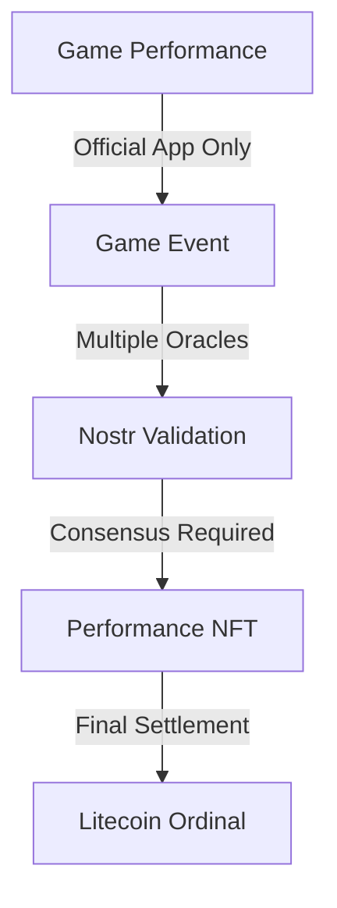

# Oracle Validation Chain

## Validation Ladder



## 1. Game Layer Security

```javascript
class GameSecurity {
    // App signature system
    appSignature: {
        type: "ed25519",
        keyStorage: "secure_enclave",
        rotation: "monthly"
    };

    // Performance recording
    performanceCapture: {
        realtime: true,
        metrics: ["inputs", "physics", "achievements"],
        antiCheat: {
            inputValidation: true,
            timeCheck: true,
            stateVerification: true
        }
    };

    // Event creation
    async createGameEvent(performance) {
        return {
            kind: 31337,
            content: {
                game: "SACQ",
                performance: performance,
                timestamp: Date.now(),
                appSignature: await this.signPerformance(performance)
            },
            tags: [
                ["app", APP_VERSION],
                ["device", DEVICE_ID],
                ["session", SESSION_ID]
            ]
        };
    }
}
```

## 2. Oracle Network

```javascript
class OracleNetwork {
    // Oracle requirements
    requirements: {
        minReputation: number,    // Nostr reputation
        stakingAmount: number,    // LTC stake
        uptime: number,           // Required availability
        responseTime: number      // Max validation time
    };

    // Validation process
    async validatePerformance(event) {
        // 1. Check app signature
        const validApp = await verifyAppSignature(event);

        // 2. Verify game physics
        const validPhysics = await verifyGamePhysics(event);

        // 3. Check time consistency
        const validTime = await verifyTimeConsistency(event);

        // 4. Validate achievements
        const validAchievements = await verifyAchievements(event);

        return {
            valid: validApp && validPhysics && validTime && validAchievements,
            signature: await this.signValidation(event)
        };
    }
}
```

## 3. Consensus System

```javascript
class ConsensusSystem {
    // Consensus requirements
    requirements: {
        minOracles: 5,            // Minimum validators
        consensusThreshold: 0.8,  // 80% agreement needed
        timeWindow: 300,          // 5 minutes to reach consensus
        stakePenalty: 1000        // LTC penalty for bad validation
    };

    // Consensus building
    async buildConsensus(validations) {
        // 1. Collect oracle validations
        const responses = await collectValidations(validations);

        // 2. Check threshold
        const consensus = await checkConsensusThreshold(responses);

        // 3. Verify stakes
        const stakes = await verifyOracleStakes(responses);

        // 4. Create final proof
        return consensus && stakes ? await createConsensusProof(responses) : null;
    }
}
```

## 4. NFT Minting

```javascript
class NFTMinting {
    // Minting requirements
    requirements: {
        consensusProof: true,     // Must have oracle consensus
        validPerformance: true,   // Must be valid game performance
        uniqueAward: true,        // No duplicate awards
        timelock: 1800            // 30 min waiting period
    };

    // Minting process
    async mintPerformanceNFT(event, consensus) {
        // 1. Verify consensus
        const validConsensus = await verifyConsensus(consensus);

        // 2. Check uniqueness
        const isUnique = await checkUniqueness(event);

        // 3. Wait timelock
        await enforceTimelock(this.requirements.timelock);

        // 4. Create Ordinal
        return validConsensus && isUnique ? 
            await createOrdinal(event, consensus) : null;
    }
}
```

## Security Measures

### 1. App Security
- Official app signatures
- Secure key storage
- Regular key rotation
- Device fingerprinting

### 2. Oracle Security
- Staking requirements
- Reputation tracking
- Performance monitoring
- Slashing conditions

### 3. Consensus Security
- Multi-oracle validation
- Timelock periods
- Stake penalties
- Proof verification

### 4. NFT Security
- Unique minting
- Consensus requirement
- Timelock enforcement
- Chain of proof

## Anti-Cheat Measures

### 1. Game Level
```javascript
class AntiCheat {
    // Real-time checks
    checks: {
        inputValidation: true,    // Check input patterns
        physicsVerification: true, // Verify game physics
        timeConsistency: true,    // Check timing
        stateValidation: true     // Verify game state
    };

    // Cheat detection
    detection: {
        patternAnalysis: true,    // Look for cheat patterns
        anomalyDetection: true,   // Detect unusual behavior
        replayValidation: true,   // Verify replays
        deviceChecks: true        // Check device integrity
    };
}
```

### 2. Network Level
```javascript
class NetworkSecurity {
    // Connection validation
    validation: {
        connectionType: "secure_websocket",
        encryption: "end_to_end",
        heartbeat: "required",
        latencyChecks: true
    };

    // Data verification
    verification: {
        packetValidation: true,   // Check packet integrity
        stateSync: true,          // Verify game state
        replayProtection: true,   // Prevent replay attacks
        timestampCheck: true      // Verify timing
    };
}
```

## Implementation Strategy

### 1. Initial Release
- Official app only
- Basic oracle network
- Simple consensus
- Manual review backup

### 2. Enhanced Security
- Advanced anti-cheat
- More oracles
- Automated consensus
- Faster validation

### 3. Full System
- Multiple apps support
- Large oracle network
- Instant consensus
- Automated minting

## Next Steps

1. **App Security**
   - Implement app signatures
   - Build anti-cheat
   - Create validation system
   - Test security measures

2. **Oracle Network**
   - Set up initial oracles
   - Implement staking
   - Create consensus system
   - Build validation chain

3. **Testing**
   - Security testing
   - Performance testing
   - Cheat detection
   - System resilience
