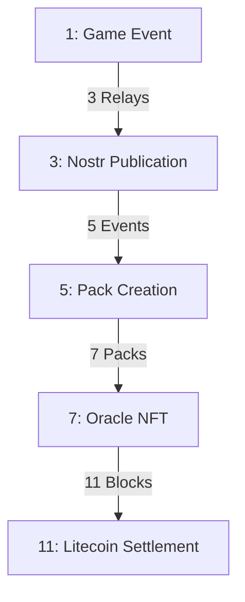

# Prime Number Settlement Flow

## Prime Settlement Chain



## 1. Game Event (Prime 1)
```javascript
class GameEvent {
    // Single performance
    event: {
        kind: 31337,
        pubkey: string,
        content: {
            game: "SACQ",
            performance: {
                score: number,
                tricks: string[],
                timestamp: number
            }
        },
        sig: string  // Game signature
    };

    // Must be unique (prime 1)
    uniqueConstraints: {
        onePerformance: true,
        oneSignature: true,
        oneTimestamp: true
    }
}
```

## 3. Nostr Publication (Prime 3)
```javascript
class NostrPublication {
    // Requires 3 relays
    relayRequirements: {
        minRelays: 3,
        relayTypes: ["primary", "backup", "archive"],
        confirmations: 3
    };

    // Relay validation
    async validateRelays(event) {
        return {
            seen: string[],        // Relay pubkeys
            timestamps: number[],   // Seen timestamps
            signatures: string[]    // Relay signatures
        };
    }
}
```

## 5. Pack Creation (Prime 5)
```javascript
class PackCreation {
    // 5 events per pack
    packRequirements: {
        eventCount: 5,
        uniqueEvents: true,
        timeWindow: 28 * 24 * 60 * 60,  // 28 days
        performance: "verified"
    };

    // Pack structure
    pack: {
        events: GameEvent[],      // 5 events
        metadata: {
            created: timestamp,
            difficulty: number,
            rarity: string
        },
        proof: {
            events: string[],     // Event hashes
            relays: string[],     // Relay signatures
            pack: string         // Pack signature
        }
    }
}
```

## 7. Oracle NFT (Prime 7)
```javascript
class OracleNFT {
    // 7 packs required
    requirements: {
        packCount: 7,
        uniquePacks: true,
        validProofs: true,
        consensusNeeded: true
    };

    // Oracle validation
    validation: {
        oracles: string[],       // Oracle pubkeys
        consensus: number,       // Required agreement
        timelock: number,       // Lock period
        stakes: number[]        // Oracle stakes
    };

    // NFT creation
    nft: {
        packs: Pack[],          // 7 packs
        metadata: {
            cycle: number,
            difficulty: number,
            rarity: string
        },
        proof: {
            packs: string[],    // Pack hashes
            oracles: string[],  // Oracle signatures
            consensus: string   // Consensus proof
        }
    }
}
```

## 11. Litecoin Settlement (Prime 11)
```javascript
class LitecoinSettlement {
    // 11 block confirmation
    settlement: {
        blocks: 11,              // Confirmation blocks
        ordinal: {
            id: string,
            content: NFT,
            inscription: string
        },
        proof: {
            blocks: string[],    // Block hashes
            txid: string,       // Transaction ID
            timestamp: number   // Settlement time
        }
    };

    // Final state
    finalState: {
        settled: boolean,
        tradeable: boolean,
        redeemable: boolean,
        verifiable: boolean
    }
}
```

## Mathematical Properties

### Prime Progression
```javascript
class PrimeProgression {
    // Prime checkpoints
    primes: {
        gameEvent: 1,      // Individual performance
        nostrRelays: 3,    // Publication requirement
        packEvents: 5,     // Events per pack
        oraclePacks: 7,    // Packs per NFT
        settlement: 11     // Block confirmations
    };

    // Time windows
    windows: {
        relay: 60,         // 1 minute
        pack: 300,         // 5 minutes
        oracle: 1800,      // 30 minutes
        settlement: 6600   // ~110 minutes (11 blocks)
    }
}
```

## Implementation Flow

### 1. Event Creation
```javascript
async function createGameEvent(performance) {
    // Prime 1: One unique event
    const event = new GameEvent(performance);
    await validateUniqueness(event);
    return signEvent(event);
}
```

### 2. Relay Publication
```javascript
async function publishToRelays(event) {
    // Prime 3: Three relay confirmation
    const relays = await selectRelays(3);
    const publications = await broadcast(event, relays);
    return validatePublications(publications);
}
```

### 3. Pack Assembly
```javascript
async function createPack(events) {
    // Prime 5: Five events per pack
    const pack = new Pack(events);
    await validateEventCount(5);
    return signPack(pack);
}
```

### 4. Oracle Processing
```javascript
async function processOracle(packs) {
    // Prime 7: Seven packs per NFT
    const nft = new OracleNFT(packs);
    await validatePackCount(7);
    return createNFT(nft);
}
```

### 5. Chain Settlement
```javascript
async function settleOnChain(nft) {
    // Prime 11: Eleven block confirmation
    const inscription = await createOrdinal(nft);
    await waitConfirmations(11);
    return finalizeSettlement(inscription);
}
```

## Security Benefits

### 1. Prime-based Security
- Natural rate limiting
- Predictable progression
- Mathematical verification
- Prime factorization checks

### 2. Multi-layer Validation
- Game validation (1)
- Relay consensus (3)
- Pack verification (5)
- Oracle agreement (7)
- Chain settlement (11)

### 3. Time-based Security
- Progressive delays
- Natural cooldowns
- Verification windows
- Settlement periods

## Next Steps

1. **Implementation Priority**
   - Game event system
   - Relay selection
   - Pack creation
   - Oracle network
   - Settlement process

2. **Testing Requirements**
   - Prime progression
   - Relay consensus
   - Pack verification
   - Oracle validation
   - Chain settlement

3. **Security Audit**
   - Mathematical verification
   - Time window analysis
   - Consensus mechanisms
   - Settlement guarantees
