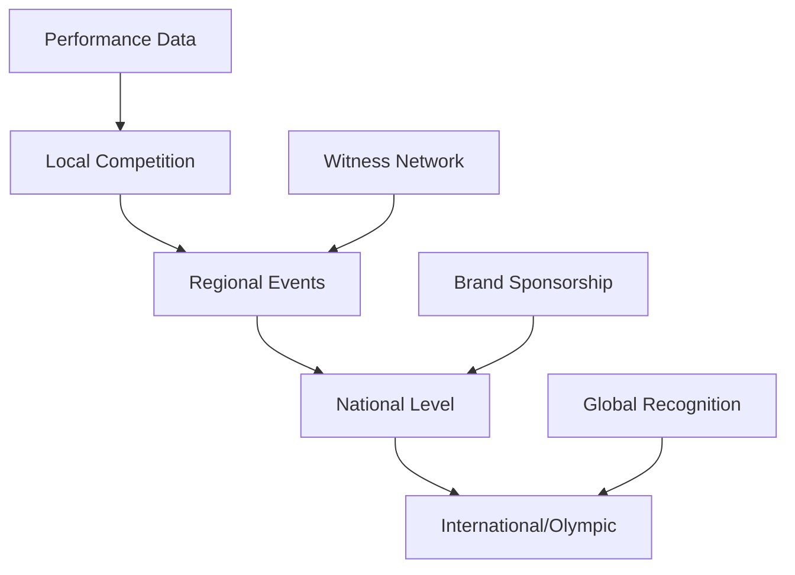
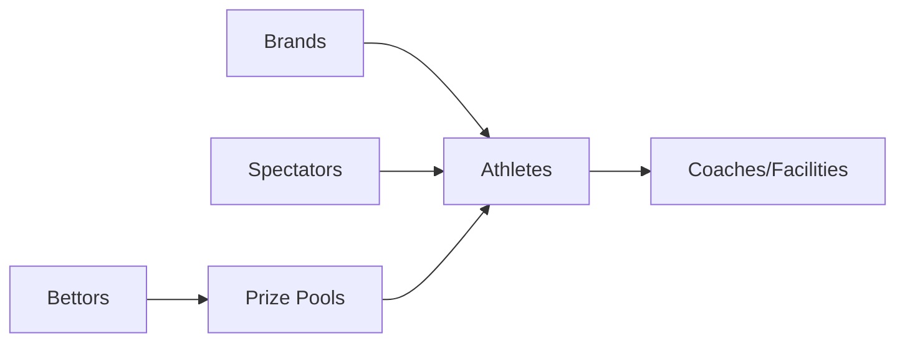

# Proof of Performance Network: A Human-Powered Blockchain

## Vision
Transform athletic achievement and spectator engagement into verifiable value through a decentralized network that:
- Bootstraps athletic careers
- Rewards spectator attention
- Creates verifiable performance history
- Enables direct value transfer
- Builds permanent proof of achievement

## Core Components

### 1. Athletic Performance Layer


#### Performance Tracking
- Competition results
- Training metrics
- Achievement milestones
- Skill progression
- Performance analytics

#### Career Progression
- Local competitions
- Regional qualifiers
- National rankings
- International standing
- Olympic pathway

### 2. Social Proof Layer (Nostr)
```javascript
// Performance Event Structure
class PerformanceEvent {
    kind: 1337,  // Custom event type
    content: {
        type: "performance",
        sport: "string",
        metrics: {
            score: number,
            difficulty: number,
            execution: number
        },
        location: {
            coordinates: [lat, long],
            venue: string
        },
        competition: {
            name: string,
            level: "local" | "regional" | "national" | "international"
        }
    },
    tags: [
        ["p", "performer_pubkey"],
        ["witness", "witness_pubkey1"],
        ["witness", "witness_pubkey2"],
        ["e", "related_event"],
        ["t", "sport_type"]
    ]
}
```

#### Witness Network
- Spectator validation
- Peer verification
- Coach attestation
- Judge scoring
- Community consensus

#### Social Engagement
- Fan following
- Performance comments
- Skill ratings
- Achievement celebrations
- Community support

### 3. Value Network (AreteCoin)

#### Direct Value Flows


#### Value Creation Methods
1. **Performance Rewards**
   - Competition prizes
   - Skill achievement bonuses
   - Progress milestones
   - Training completion rewards

2. **Spectator Engagement**
   - Attention rewards
   - Prediction accuracy
   - Witness participation
   - Community contribution

3. **Brand Integration**
   - Sponsored challenges
   - Achievement rewards
   - Performance bonuses
   - Training support

### 4. Oracle Network

#### Validation Types
```javascript
// Validation Structure
class ValidationNode {
    // Performance validation
    async validatePerformance(event) {
        return {
            technicalScore: calculateTechnical(event),
            witnessConsensus: getWitnessAgreement(event),
            difficultyRating: assessDifficulty(event),
            executionScore: scoreExecution(event)
        };
    }

    // Witness credibility
    async validateWitnesses(witnesses) {
        return {
            pastAccuracy: getHistoricalAccuracy(witnesses),
            consensusAlignment: checkConsensusHistory(witnesses),
            stakingHistory: getStakingRecord(witnesses)
        };
    }

    // Value distribution
    async validateValueFlow(transaction) {
        return {
            performanceBased: calculatePerformanceShare(transaction),
            witnessRewards: calculateWitnessRewards(transaction),
            stakingReturns: calculateStakingRewards(transaction)
        };
    }
}
```

#### Consensus Mechanisms
1. **Performance Consensus**
   - Technical validation
   - Witness agreement
   - Peer verification
   - Historical consistency

2. **Value Consensus**
   - Fair distribution
   - Reward calculation
   - Penalty assessment
   - Stake management

### 5. Settlement Layer (Litecoin)

#### Transaction Types
1. **Performance Records**
   - Achievement proofs
   - Competition results
   - Ranking updates
   - Skill certifications

2. **Value Transfers**
   - Competition prizes
   - Spectator rewards
   - Brand payments
   - Training investments

#### Settlement Process
```javascript
// Settlement Structure
class SettlementBatch {
    performances: PerformanceRecord[];
    valueMoves: ValueTransfer[];
    witnesses: WitnessAttestation[];
    oracles: OracleValidation[];
    
    async createOrdinal() {
        return {
            type: "proof_of_performance",
            timestamp: Date.now(),
            records: this.performances,
            value: this.valueMoves,
            proof: await this.generateProof()
        };
    }
}
```

## Implementation Strategy

### Phase 1: Foundation
1. **Basic Performance Tracking**
   - Event recording
   - Witness validation
   - Basic metrics

2. **Simple Value Transfer**
   - Direct payments
   - Competition prizes
   - Witness rewards

### Phase 2: Network Growth
1. **Enhanced Performance Metrics**
   - Advanced analytics
   - Progress tracking
   - Skill assessment

2. **Expanded Value System**
   - Brand integration
   - Spectator rewards
   - Training incentives

### Phase 3: Full Integration
1. **Complete Career Tracking**
   - Full progression system
   - Olympic pathway integration
   - Global ranking

2. **Advanced Economy**
   - Complex reward systems
   - Investment mechanisms
   - Career funding

## Example Applications

### 1. HackySack Game
```javascript
// Game Event Structure
class HackySackEvent {
    type: "trick_completion",
    difficulty: number,
    execution: number,
    witnesses: string[],
    video: string,
    bets: {
        amount: number,
        predictor: string,
        prediction: string
    }[]
}
```

### 2. Olympic Qualifier
```javascript
// Qualifier Structure
class QualifierEvent {
    sport: string,
    level: "local" | "regional" | "national",
    requirements: Requirement[],
    judges: string[],
    witnesses: string[],
    results: Performance[],
    progression: ProgressionPath
}
```

### 3. Training Progress
```javascript
// Progress Structure
class TrainingEvent {
    athlete: string,
    coach: string,
    metrics: MetricSet[],
    goals: Goal[],
    achievements: Achievement[],
    rewards: Reward[]
}
```

## Network Benefits

### For Athletes
- Career funding
- Performance verification
- Progress tracking
- Direct fan engagement
- Brand connections

### For Spectators
- Engagement rewards
- Direct support options
- Verified predictions
- Community participation
- Value creation

### For Brands
- Direct athlete access
- Verified performance data
- Engagement metrics
- Community integration
- Value distribution

### For Sport
- Funding mechanism
- Talent discovery
- Progress tracking
- Career pathways
- Global integration

## Future Extensions

### 1. AI Integration
- Performance analysis
- Prediction models
- Training optimization
- Value assessment

### 2. VR/AR Features
- Virtual training
- Remote witnessing
- Enhanced viewing
- Interactive coaching

### 3. Global Systems
- International rankings
- Cross-sport metrics
- Universal standards
- Global competitions

## Next Steps

1. **Prototype Development**
   - HackySack game implementation
   - Basic witness network
   - Simple value transfer
   - Performance tracking

2. **Network Testing**
   - Local competitions
   - Witness validation
   - Value distribution
   - Settlement verification

3. **Community Building**
   - Athlete onboarding
   - Witness recruitment
   - Brand partnerships
   - Developer tools
