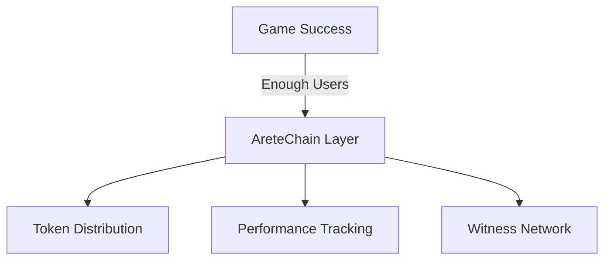
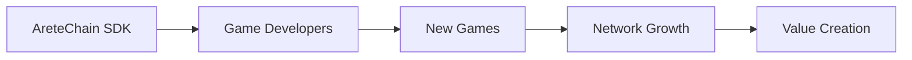
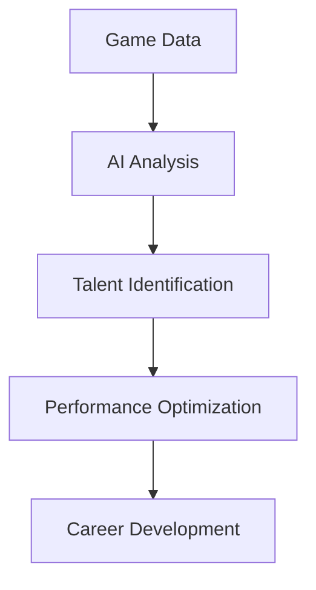

# Phased Rollout Strategy: From Game to Network

## Phase 1: Game Launch (sacq.fun)
- Release iOS/Android game
- Focus on pure gameplay and fun
- Build organic user base
- Collect performance metrics silently
- Start identifying top players

## Phase 2: AreteChain Integration

### Integration Points
1. **Performance Tracking**
   - Game scores
   - Trick completion
   - Time played
   - Achievement unlocks

2. **Social Features**
   - Player rankings
   - Replays sharing
   - Community challenges
   - Tournament systems

3. **Initial Token Distribution**
   - Top player rewards
   - Historical recognition
   - Community participation
   - Tournament prizes

## Phase 3: Developer Platform

### Developer Tools
1. **SDK Components**
   - Performance tracking
   - Token integration
   - Witness network
   - Value distribution

2. **Documentation**
   - Integration guides
   - Best practices
   - Example implementations
   - API references

3. **Developer Incentives**
   - Revenue sharing
   - Token allocation
   - Early adopter bonuses
   - Community support

## Phase 4: Medalloid.com Reboot

### AI-Powered Sports Analytics

### Platform Features
1. **Performance Analysis**
   - AI pattern recognition
   - Skill progression tracking
   - Potential prediction
   - Training recommendations

2. **Career Development**
   - Talent spotting
   - Progress tracking
   - Achievement verification
   - Opportunity matching

3. **Community Integration**
   - Coach connections
   - Team formation
   - Competition organization
   - Sponsorship matching

## Timeline and Milestones

### Q1-Q2 2025: Game Launch
- [ ] iOS App Store release
- [ ] Google Play Store release
- [ ] Initial user acquisition
- [ ] Basic analytics implementation

### Q3-Q4 2025: AreteChain Integration
- [ ] Token system development
- [ ] Performance tracking integration
- [ ] Witness network implementation
- [ ] Initial token distribution

### Q1-Q2 2026: Developer Platform
- [ ] SDK development
- [ ] Documentation creation
- [ ] Developer onboarding
- [ ] First partner integrations

### Q3-Q4 2026: Medalloid Reboot
- [ ] AI system development
- [ ] Analytics platform launch
- [ ] Talent tracking implementation
- [ ] Full ecosystem integration

## Success Metrics

### Game Metrics
- Daily Active Users
- Session Length
- Retention Rates
- Achievement Completion

### Network Metrics
- Token Distribution
- Witness Participation
- Developer Adoption
- Transaction Volume

### Platform Metrics
- AI Analysis Accuracy
- Talent Identification Success
- Career Progression Rates
- Community Growth

## Risk Management

### Game Risks
- User adoption
- Platform stability
- Gameplay balance
- Technical issues

### Network Risks
- Token economics
- Network security
- Scaling challenges
- Regulatory compliance

### Platform Risks
- AI accuracy
- Data privacy
- User trust
- Market acceptance

## Next Steps

1. **Immediate Actions**
   - Complete game development
   - Prepare store submissions
   - Set up analytics
   - Plan marketing strategy

2. **Near-Term Planning**
   - Design token economics
   - Develop integration specs
   - Create developer docs
   - Build AI models

3. **Long-Term Vision**
   - Expand game ecosystem
   - Grow developer network
   - Launch full platform
   - Scale globally
