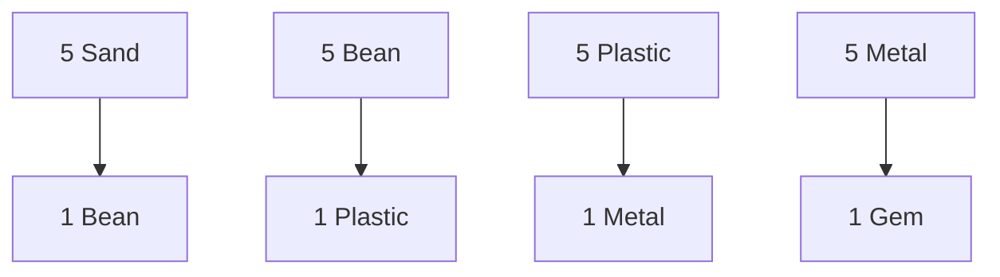

# SACQ NFT System: Digital to Physical Hackysacks

## Rarity Tiers

### 1. Sand Sacks
```javascript
{
    type: "sand",
    maxSupplyPer28: 10000,    // Based on sand availability
    properties: {
        weight: "light",
        behavior: "fast",
        difficulty: "beginner"
    },
    realWorldEquiv: {
        material: "beach sand",
        weight: "80g",
        cost: "~$5"
    }
}
```

### 2. Bean Sacks
```javascript
{
    type: "bean",
    maxSupplyPer28: 5000,     // Based on bean harvests
    properties: {
        weight: "medium",
        behavior: "balanced",
        difficulty: "intermediate"
    },
    realWorldEquiv: {
        material: "mung beans",
        weight: "100g",
        cost: "~$10"
    }
}
```

### 3. Plastic Sacks
```javascript
{
    type: "plastic",
    maxSupplyPer28: 2500,     // Based on production capacity
    properties: {
        weight: "light",
        behavior: "predictable",
        difficulty: "advanced"
    },
    realWorldEquiv: {
        material: "recycled plastic pellets",
        weight: "60g",
        cost: "~$15"
    }
}
```

### 4. Metal Sacks
```javascript
{
    type: "metal",
    maxSupplyPer28: 1000,     // Based on metal availability
    properties: {
        weight: "heavy",
        behavior: "precise",
        difficulty: "expert"
    },
    realWorldEquiv: {
        material: "steel shot",
        weight: "120g",
        cost: "~$25"
    }
}
```

### 5. Gem Sacks
```javascript
{
    type: "gem",
    maxSupplyPer28: 100,      // Based on gem rarity
    properties: {
        weight: "custom",
        behavior: "unique",
        difficulty: "master"
    },
    realWorldEquiv: {
        material: "semi-precious stones",
        weight: "varies",
        cost: "~$100+"
    }
}
```

## Crafting System

### Upgrade Paths


### Crafting Rules
```javascript
class SackCrafting {
    // Basic upgrades
    craftingRules: {
        toBean: {
            requires: ["sand", "sand", "sand", "sand", "sand"],
            bonus: "random_property_boost"
        },
        toPlastic: {
            requires: ["bean", "bean", "bean", "bean", "bean"],
            bonus: "special_color"
        },
        toMetal: {
            requires: ["plastic", "plastic", "plastic", "plastic", "plastic"],
            bonus: "weight_customization"
        },
        toGem: {
            requires: ["metal", "metal", "metal", "metal", "metal"],
            bonus: "unique_effect"
        }
    }
}
```

## Special Editions

### Limited Runs
```javascript
class SpecialEdition {
    // Monthly specials
    lunar: {
        type: "any",
        maxSupply: 28,        // One per day
        specialProperties: ["glow", "pattern", "weight"]
    },
    
    // Tournament editions
    tournament: {
        type: "metal_or_gem",
        maxSupply: 3,         // Top 3 positions
        specialProperties: ["signature", "date", "rank"]
    },
    
    // Seasonal collections
    seasonal: {
        type: "all",
        maxSupply: 100,       // Per season
        specialProperties: ["theme", "color", "effect"]
    }
}
```

## Physical Redemption

### Redemption System
```javascript
class PhysicalRedemption {
    // Requirements for physical redemption
    requirements: {
        minHoldTime: "28 days",
        condition: "unused",
        shipping: "global"
    },
    
    // Verification process
    verification: {
        proofOfOwnership: "ltc_signature",
        addressCheck: "shipping_verification",
        redemptionCode: "unique_per_sack"
    }
}
```

## Monthly Distribution

### Distribution Rules
```javascript
class MonthlyDrop {
    // New supply each 28 days
    supply: {
        sand: 10000,
        bean: 5000,
        plastic: 2500,
        metal: 1000,
        gem: 100
    },
    
    // Distribution methods
    methods: {
        tournament: "top_performers",
        daily: "best_in_day",
        achievement: "skill_based",
        special: "random_events"
    }
}
```

## Trading System

### Trade Rules
```javascript
class TradingSystem {
    // Direct trades
    peerToPeer: {
        enabled: true,
        platform: "ltc_ordinals",
        verification: "oracle_network"
    },
    
    // Marketplace
    marketplace: {
        type: "decentralized",
        fees: "minimal",
        listing: "any_ordinal_marketplace"
    }
}
```

## Achievement Integration

### Achievement NFTs
```javascript
class AchievementSystem {
    // Performance tracking
    tracking: {
        tricks: ["number", "difficulty", "combo"],
        time: ["duration", "consistency", "improvement"],
        competition: ["rank", "wins", "special_moments"]
    },
    
    // Achievement rewards
    rewards: {
        milestone: "special_edition_sack",
        mastery: "gem_sack",
        legendary: "unique_physical_sack"
    }
}
```

## Implementation Notes

### 1. Technical Requirements
- Ordinal inscription format
- Proof of authenticity system
- Trading mechanism
- Physical redemption system

### 2. Security Considerations
- Ownership verification
- Trade validation
- Redemption security
- Supply management

### 3. User Experience
- Easy trading interface
- Clear crafting rules
- Achievement tracking
- Physical redemption process

## Next Steps

1. **Technical Implementation**
   - NFT structure design
   - Crafting system
   - Trading platform
   - Physical redemption

2. **Content Creation**
   - Sack designs
   - Special editions
   - Achievement system
   - Physical products

3. **Community Building**
   - Trading guidelines
   - Crafting tutorials
   - Collection showcase
   - Physical redemption guide
